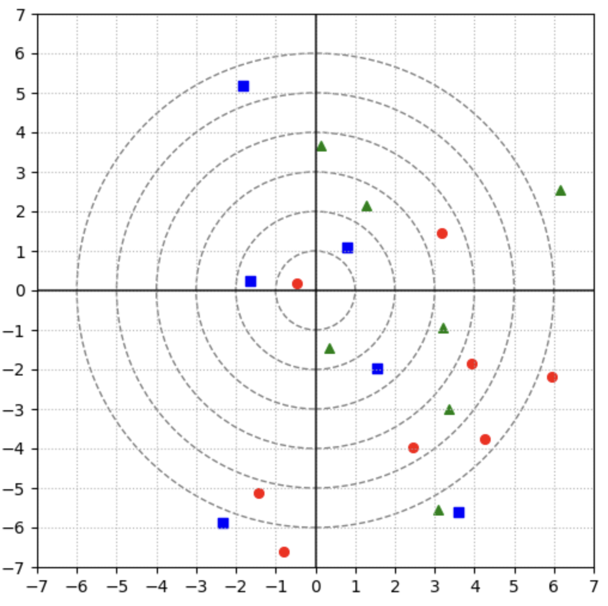

# Midterm Contest

## A. ML terms 3

What are the main branches of machine learning? Choose all that apply.

__Answer:__
* __supervised learning__
* __unsupervised learning__
* __reinforcement learning__

## B. kNN shapes 3
A `k-NN` model is used to classify points. For which values of $k$ the point $(0,0)$ will be classified as green triangle? The metric is Euclidean.



__Answer:__

* __k=9__
* __k=12__

## C. Linear outlier slope

Let $\hat{a}$ and $\hat{b}$ be the optimal parameters of the 1-d linear regression $y = ax + b$ fitted on the dataset $(x_i, y_i), i = 1, \ldots, n$. Denote

* $\bar{x} = \frac{1}{n} \sum\limits_{i=1}^{n} x_i$ (sample average of features);

* $\bar{y} = \frac{1}{n} \sum\limits_{i=1}^{n} y_i$ (sample average of labels);
  
* $\mathbb{V} (x) = \frac{1}{n} \sum\limits_{i=1}^{n} (x_i - \bar{x})$ (sample variance of features).


Suppose that one of the labels $(y_k)$ was spoiled by some noise, and its value turned to $(y_k + M)$. What will be the new value of $(\hat{a})$ after training of the linear regression of the altered dataset?

__Answer:__

$\hat{a}_{\text{new}} = \hat{a} + \frac{M(x_k - \bar{x})}{n\mathbb{V}(x)}$

## D. Regression matrix of degree 4
Consider a polynomial regression model of degree 
$4$:

$$
y=w_0 + w_1x + w_2x^2 +w_3x^3 + w_4x^4. 
$$

Given three objects $x_1 = -2, x_2 = -1, x_3 = 0, x_4 = 1, x_5 = 2$ rewrite this model in matrix form $y=Xw$. Type $tr(X)$ as your answer.

__Answer:__

__17__

## E. Confusion matrix 2

The true labels (0 = **negative**, 1 = **positive**) and model predictions — probabilities of class 1 — are shown in the table.

| $y_{\text{true}}$ | $y_{\text{pred}}$ |
|--------|------------------------------|
| 0      | 0.042  |
| 1      | 0.619  |
| 0      | 0.320  |
| 0      | 0.838  |
| 0      | 0.289  |
| 0      | 0.088  |
| 1      | 0.116  |
| 1      | 0.428  |
| 1      | 0.567  |
| 0      | 0.535  |
| 1      | 0.150  |
| 0      | 0.044  |

The answer of the classifier is given by the formula $[y_{\text{pred}} \ge 0.3]$ Find the confusion matrix of the classifier. Type 4 integers TP, FP, FN, TN separated by a single whitespace.

__Answer:__

__3 2 3 4__


## F. Binary metrics 2

Using the confusion matrix from the previous problem, calculate the following metrics:

* accuracy;
* precision;
* recall;
* f1 score.

For submission type four numbers in the specified order separated by a single whitespace. Round your answers up to 3 digits after the decimal point if necessary.

### Notes
For instance, if your answers are 0.12, 0.123, 0.1234, 0.1666666666, type 0.12 0.123 0.123 0.167

__Answer:__

__0.583 0.6 0.5 0.545__


## G. Prob linear model 1

The optimal weights $\bar{w}$ of a linear regression model with $L_2$-regularization are the same as...

__Answer__:

**MAP estimation of Gaussian model with Gaussian prior**

## H. Info gain 1

There are $4$ classes in the current node of the decision tree. The counts of each class are $(2,2,4,8).$ After binary split these numbers become $(0,0,4,4)$ in the left child $(2, 2, 0, 4)$ in the right. Find the information gain of this split, using entropy criterion with binary logarithm.

__Answer:__

__0.5__

## I. Ridge weights

Implement `RidgeWeights` function which receives a feature matrix $X$ of full column rank, target vector $y$ and regularization coefficient $C > 0$ (equals to $1$ by default). The function should return the weights of the ridge regression.

### Notes
Your function must be called `RidgeWeights` with signature

`def RidgeWeights(X: np.array, y: np.array, C: float) -> np.array:`

```python
import numpy as np

def RidgeWeights(X: np.array, y: np.array, C: float = 1.0) -> np.array:
    num_features = X.shape[1]
    
    identity_matrix = np.identity(num_features)
    
    w = np.linalg.inv(np.dot(X.T, X) + C * identity_matrix).dot(X.T).dot(y)
    
    return w

```
 
## J. Binary classification in space

The score in this problem will be fractional, from 0 to 2 points.


The modern cosmologist Arkady knows for sure that theoretically there should be a balance of ordinary and dwarf galaxies in the Universe. However, the problem of the shortage of dwarf galaxies, known since the 20th century, is that the number of observed dwarf galaxies is many times less than predicted by theory.

Arcady has a collected dataset of 1000 observed galaxies, which are described by 13 numerical features, the class label is known for them (0 - dwarf, 1 - ordinary).

Help Arkady train a binary classifier that will work as accurately as possible on real data — all galaxies.

P.S. The real data is a thousand times larger and confirms the theoretical distribution of ordinary and dwarf galaxies.

__About dataset__

All data can be downloaded [here](https://disk.yandex.ru/d/g8qNuxf0Funj5w).

You are provided with three files:

— The `train.csv` file contains data on 1000 observed galaxies and their classes in the target column. Each line is a set of real numbers (decimal separator - dot) separated by commas

— The `test.csv` file contains data on unobserved galaxies that you have to label

— The `sample_submission.csv` file is an example of a correct submission

What should be done

Upload the `answers.csv` file to the system, each line of which contains the class (in the target column) and the Id of the galaxy, separated by a comma.

Your score in this problem will be calculated as

$min(2, (accuracy - 0.55)/0.17)$,

where `accuracy` is the proportion of correctly classified galaxies according to your predictions.